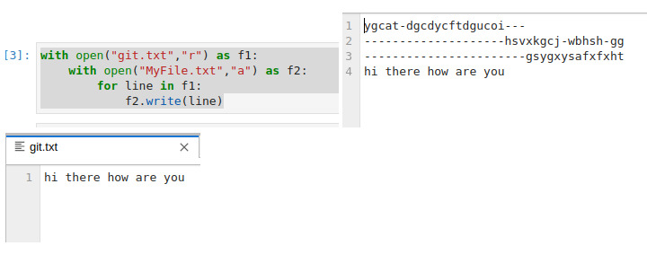

# copy-file
## AIM:
To write a python program for copying the contents from one file to another file.
## EQUIPEMENT'S REQUIRED: 
PC
Anaconda - Python 3.7
## ALGORITHM: 

Step 1:
Open the first file in read mode

Step 2:
Open the second file in append mode

Step 3:
Every word in first file is copied to second file using write()

Step 4:
close the first file

Step 5:
close the second file

## PROGRAM:
To write a program for copying the contents from one file to another file.
Developed by: Rakesh J.S
RegisterNumber: 22009339

with open("git.txt","r") as f1:
    with open("MyFile.txt","a") as f2:
        for line in f1:
            f2.write(line)

### OUTPUT:

## RESULT:
Thus the program is written to copy the contents from one file to another file.
